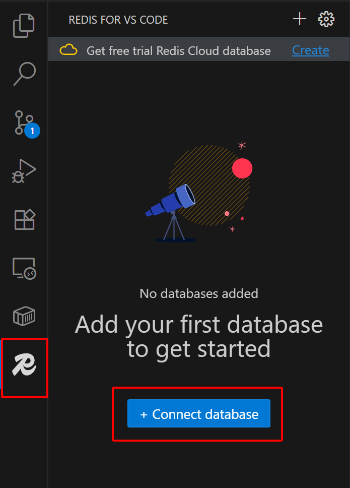

# 🚀 Project Management System

A **full-stack project management web application** built with **Express + MongoDB (Backend)** and **React + Vite (Frontend)**.  
The app supports **workspaces, projects, sprints, tasks, comments, notifications, email invitations, and authentication** via **Email/Password or Google OAuth2**.

---

## 🧩 Tech Stack

**Backend:**

- Node.js, Express, MongoDB, Mongoose
- JWT authentication
- Google OAuth2
- Nodemailer for email service

**Frontend:**

- React (Vite)
- React Router DOM
- Tailwind CSS (optional for styling)

---

## ✨ Main Features

- 🧭 **Workspace Management**

  - Create, update, invite, or remove members
  - Manage workspace roles

- 🧱 **Project Management**

  - Create projects inside a workspace
  - Add members and sprints
  - Update or delete projects

- 🕓 **Sprint Management**

  - Create, view, and delete sprints within projects

- 🧑‍💻 **Task Management**

  - Create, assign, update, and delete tasks
  - Add comments and track history

- 🔔 **Notifications**

  - Real-time notifications for user activities

- 📬 **Email Invitations**

  - Invite members via email with signed tokens

- 🔐 **Authentication**
  - Login/Register via Email & Password
  - Google OAuth2 login
  - JWT token stored securely in cookies

---

## 📁 Folder Structure Overview

```
project-management/
├── backend/
│   ├── server.js                # Entry point
│   ├── config/                  # Config files (DB, passport)
│   ├── controllers/             # Business logic
│   ├── models/                  # Mongoose schemas
│   ├── routes/                  # API routes
│   ├── services/                # Services (e.g., notification)
│   └── utils/sendMail.js        # Email utility
│
└── frontend/
    ├── src/                     # React source code
    ├── index.html
    └── vite.config.js
```

---

## ⚙️ Environment Variables

Create a `.env` file in the `backend/` directory with the following:

| Variable               | Description                                       |
| ---------------------- | ------------------------------------------------- |
| `CONNECTION_STRING`    | MongoDB connection URI                            |
| `PORT`                 | Backend server port (default: `4000`)             |
| `JWT_SECRET`           | Secret key for JWT                                |
| `INVITE_SECRET`        | Secret for signing workspace invites              |
| `GOOGLE_CLIENT_ID`     | Google OAuth client ID                            |
| `GOOGLE_CLIENT_SECRET` | Google OAuth client secret                        |
| `BACKEND_URL`          | Backend base URL (e.g., `http://localhost:4000`)  |
| `FRONTEND_URL`         | Frontend base URL (e.g., `http://localhost:5173`) |
| `EMAIL_USER`           | Email address used to send mail                   |
| `EMAIL_PASS`           | App-specific password for email                   |

**Frontend optional:**

| Variable       | Description          |
| -------------- | -------------------- |
| `VITE_API_URL` | Backend API base URL |

---

## 🧑‍💻 Installation & Local Setup

### 1️⃣ Backend

```bash
cd backend
npm install
```

Create a `.env` file as shown above.  
Then start the backend server:

```bash
npm run start
```

The server runs at **http://localhost:4000**

---

### 2️⃣ Frontend

```bash
cd frontend
npm install
npm run dev
```

Vite will start the app on **http://localhost:5173**

---

## 🧠 API Overview

All APIs return **JSON** and most are protected by JWT (`authMiddleware`).

### 🔑 Authentication

| Method | Endpoint                | Description           |
| ------ | ----------------------- | --------------------- |
| `POST` | `/auth/register`        | Register a new user   |
| `POST` | `/auth/login`           | User login            |
| `GET`  | `/auth/google`          | Google OAuth login    |
| `GET`  | `/auth/google/callback` | Google OAuth callback |

### 👤 User

| Method | Endpoint                | Description           |
| ------ | ----------------------- | --------------------- |
| `GET`  | `/user/me`              | Get current user info |
| `PUT`  | `/user/update`          | Update profile        |
| `PUT`  | `/user/change-password` | Change password       |

### 🧭 Workspace

| Method   | Endpoint                                     | Description             |
| -------- | -------------------------------------------- | ----------------------- |
| `POST`   | `/workspace/create`                          | Create workspace        |
| `GET`    | `/workspace/my`                              | Get user’s workspaces   |
| `GET`    | `/workspace/:workspaceId`                    | Get workspace details   |
| `PUT`    | `/workspace/:workspaceId/invite`             | Invite member via email |
| `GET`    | `/workspace/invite/accept`                   | Accept workspace invite |
| `PUT`    | `/workspace/:workspaceId/update`             | Update workspace        |
| `PUT`    | `/workspace/:workspaceId/remove-member`      | Remove member           |
| `PUT`    | `/workspace/:workspaceId/update-member-role` | Update member role      |
| `DELETE` | `/workspace/:workspaceId/delete`             | Delete workspace        |

### 🧱 Project

| Method   | Endpoint                                                      | Description      |
| -------- | ------------------------------------------------------------- | ---------------- |
| `POST`   | `/workspace/:workspaceId/project/create`                      | Create project   |
| `GET`    | `/workspace/:workspaceId/project/`                            | List projects    |
| `GET`    | `/workspace/:workspaceId/project/:projectId`                  | Project details  |
| `PUT`    | `/workspace/:workspaceId/project/:projectId/add-member`       | Add member       |
| `PUT`    | `/workspace/:workspaceId/project/:projectId/edit-member-role` | Edit member role |
| `PUT`    | `/workspace/:workspaceId/project/:projectId/remove-member`    | Remove member    |
| `PUT`    | `/workspace/:workspaceId/project/:projectId/update`           | Update project   |
| `DELETE` | `/workspace/:workspaceId/project/:projectId`                  | Delete project   |

### 🗓️ Sprint

| Method | Endpoint                                                   | Description   |
| ------ | ---------------------------------------------------------- | ------------- |
| `GET`  | `/workspace/:workspaceId/project/:projectId/sprints`       | Get sprints   |
| `POST` | `/workspace/:workspaceId/project/:projectId/add-sprint`    | Add sprint    |
| `PUT`  | `/workspace/:workspaceId/project/:projectId/remove-sprint` | Remove sprint |

### ✅ Task

| Method   | Endpoint                                                           | Description      |
| -------- | ------------------------------------------------------------------ | ---------------- |
| `POST`   | `/workspace/:workspaceId/project/:projectId/task/create`           | Create task      |
| `GET`    | `/workspace/:workspaceId/project/:projectId/task/`                 | Get tasks        |
| `GET`    | `/workspace/:workspaceId/project/:projectId/task/:taskId`          | Task details     |
| `PUT`    | `/workspace/:workspaceId/project/:projectId/task/:taskId/update`   | Update task      |
| `POST`   | `/workspace/:workspaceId/project/:projectId/task/:taskId/comment`  | Add comment      |
| `DELETE` | `/workspace/:workspaceId/project/:projectId/task/`                 | Delete task      |
| `GET`    | `/workspace/:workspaceId/project/:projectId/task/sprint/:sprintId` | Get sprint tasks |

### 🔔 Notification

| Method | Endpoint                      | Description            |
| ------ | ----------------------------- | ---------------------- |
| `GET`  | `/notification/`              | Get user notifications |
| `PUT`  | `/notification/mark-as-read`  | Mark one as read       |
| `PUT`  | `/notification/mark-all-read` | Mark all as read       |

---

## 🧬 Data Models (Summary)

| Model            | Fields                                                                                                 |
| ---------------- | ------------------------------------------------------------------------------------------------------ |
| **User**         | name, email, password                                                                                  |
| **Workspace**    | name, description, owner, members [{ user, role }]                                                     |
| **Project**      | workspace, name, description, owner, members [{ user, role }], sprints[]                               |
| **Sprint**       | name, startDate, endDate, description                                                                  |
| **Task**         | project, title, description, owner, assignee, status, priority, dueDate, sprint, comments[], history[] |
| **Notification** | user, type, title, message, isRead, relatedIds                                                         |

---

## 🔒 Security Notes

- Keep all secret keys (`JWT_SECRET`, `INVITE_SECRET`, OAuth keys) safe and **never commit** them to Git.
- Gmail App Passwords must be used if using Gmail SMTP.
- Invite tokens are signed using `INVITE_SECRET` and expire within **24 hours**.

---

## 🧱 Development Workflow

1. Fork the repository
2. Create a feature branch
3. Commit and push changes
4. Open a Pull Request with a clear description

---

## ☁️ Deployment

- **Backend**: Requires Node.js and a MongoDB connection (Atlas or local)
- **Frontend**: Build with `npm run build` and deploy via Vercel, Netlify, or other hosts

---

## 📂 Quick Reference Files

| File                         | Description              |
| ---------------------------- | ------------------------ |
| `backend/server.js`          | Backend entry point      |
| `backend/config/db.js`       | MongoDB connection setup |
| `backend/config/passport.js` | Google OAuth setup       |
| `backend/utils/sendMail.js`  | Email sender utility     |
| `backend/routes/*.js`        | API routes               |
| `backend/models/*.js`        | Mongoose models          |
| `frontend/src/App.jsx`       | React app entry          |

---

## 🧭 Text2Query — Natural language to DB Query pipeline

This repository also contains a separate Python module `Text2Query` that provides a pipeline to convert natural-language prompts into database-aware queries (and/or retrieval results) using embeddings + LLMs and a small FastAPI web UI.

High-level responsibilities:

- Chunk and tag domain files (JSON schemas / descriptions) into small documents
- Generate embeddings using a local or packaged embedder model (SentenceTransformers)
- Index embeddings into a MongoDB collection (RAG / vector store)
- Provide a FastAPI endpoint to accept a natural language prompt and return a suggested query or retrieval results

Files and components (key paths inside `Text2Query/`):

- `main.py` — FastAPI app exposing `/text2query` and `/confirm_query` endpoints.
- `graph.py` (in `text2query/`) — the pipeline orchestration (see module for details).
- `chunking_embedding/chunking.py` — reads `chunking_embedding/data/*`, tags documents (using LangChain helper), embeds chunks and inserts into MongoDB.
- `chunking_embedding/data/` — JSON files used as source for chunking (schema + descriptions).
- `configs/settings.py` — pydantic settings for env-driven configuration.
- `configs/paths.py` — paths for data and model directories.
- `helper/model_embedding.py` — local embedding helper using SentenceTransformers and a MongoDB vector search wrapper.

Environment variables required by Text2Query (put into `Text2Query/.env`):

- `GEMINI_AI_API_KEY` (optional if using Gemini)
- `OPEN_AI_API_KEY` (used by some transformers / LLM calls)
- `ATLAS_CONNECTION_STRING` — MongoDB connection string used for RAG index
- `ATLAS_DB_NAME` — primary DB name
- `ATLAS_DB_RAG` — DB used to store embeddings/index
- `ATLAS_COLLECTION_RAG` — collection name for embeddings
- `INDEX_NAME` — vector index name used by MongoDB wrapper
- `MODEL_REGISTRY` — mapping or name of embedder model (configured as env JSON or simple name depending on code)
- `REDIS_HOST`, `REDIS_PORT`, `REDIS_PASSWORD` — optional redis config used by pipeline

Placeholder: Python requirements

-- Please add pip requirements below (example placeholder):

```
# requirements for Text2Query
fastapi uvicorn
langgraph
pymongo
langchain_genai
langchain_openai
sentence_transformers
langchain_mongodb
pydantic_settings
redis
```

Run instructions (overview) — fill in details below:

1. Get into `Text2Query/` folder:

   ```bash
   cd Text2Query
   ```

2. Download `models` folder into `Text2Query` directory: [https://drive.google.com/file/d/1Uj0OesVdY4v1vSDasYIl15PgvlAJm8Ny/view](https://drive.google.com/file/d/1Uj0OesVdY4v1vSDasYIl15PgvlAJm8Ny/view)

3. Populate `Text2Query/.env` with the environment variables listed above.

4. Prepare chunking data (place JSON files into `Text2Query/chunking_embedding/data/`).

5. Run chunking to build embeddings and insert into MongoDB:

   ```bash
   python chunking_embedding/chunking.py
   ```

6. Install, open `Docker desktop` and run:

   ```bash
   docker run -d --name llm-redis -p 6379:6379 redis:latest
   ```

7. Download `Redis for VS Code` extension: [https://marketplace.visualstudio.com/items?itemName=Redis.redis-for-vscode](https://marketplace.visualstudio.com/items?itemName=Redis.redis-for-vscode)

8. Click `R` icon in the sidebar and choose `+ Connect database`:
   

9. Leave default setting and click `Add Redis Database`
   

10. Start the FastAPI server (development):

   ```bash
   uvicorn main:app --reload
   ```

11. Call the endpoint from frontend or curl:

    ```
    POST http://localhost:8000/text2query
    body: { "prompt": "Find fields relating to customer address in the schema" }
    ```

---

💡 _Made with ❤️ using MERN Stack (MongoDB, Express, React, Node.js)._
